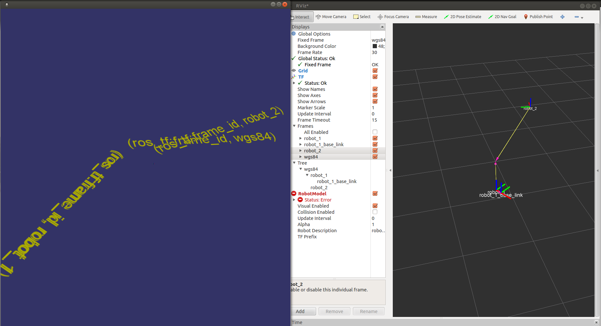
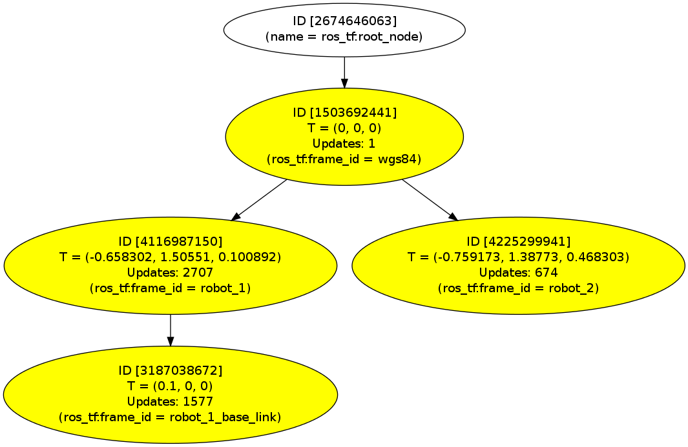

Bridges between ROS TF messages and Robot Scene Graph Nodes
==========================================================

Overview
--------

Bridges between ROS TF messages and Robot Scene Graph Nodes

Dependencies
------------

 - ROS Hydro
 - BRICS_3D library with HDF5 support. Installation instructions can be found here: http://www.best-of-robotics.org/brics_3d/installation.html
 - Open Scene Graph (optional, recommended)

Compilation
-----------

```
 $ catkin_make -DUSE_OSG=ON
```

Environment Variables
---------------------

Please make sure the following environment variables are set. (The should be ) 

Dependencies to BRICS_3D and HDF5:


| Name          | Description |
| ------------- | ----------- |
| BRICS_3D_DIR  | Points to the installation folder of BRICS_3D. Used within the CMake scripts to discover the BRICS_3D library. |
| HDF5_ROOT     | Points to the installation folder of HDF5. Use it in case it is not into installed to the default folders. |


Usage
-----

To start the example do the following:

```
rosparam set /enable_dot_visualizer true
rosparam set /root_frame_id "wgs84"
rosrun sherpa_world_model_tf_bridge sherpa_world_model_tf_bridge
```

On another terminal start the simulated robots with:

```
rosrun sherpa_world_model_tf_bridge robot_1_tf_broadcasr.py 
rosrun sherpa_world_model_tf_bridge robot_2_tf_broadcasr.py 
```

The scene can be viewed in the Open Scene Graph window (if proper compile time flags have been set) and
the ``rviz`` visualization tool as provided by ROS side by side:

  

For debugging purposes the resulting Robot Scene Graph is stored in a *dot* file format (``current_graph.gv``).  
It can be rendered with the ``dot`` tool that is part of the *graphviz* package e.g.

```
	dot current_graph.gv -Tsvg -o current_graph.gv.svg
```



Parameters
----------

Parameters can be configured with the rosparam tool. The following parameters are available:

|  Prameter name          | Default     | Description |
| ----------------------- | ----------- | ----------- |
| root_frame_id           | "base_link" | Only TF frames below this root ID are considered within the bridge. |
| enable_dot_visualizer   | false       | If set to true dot files are generated for **every** update on the RSG. |

Examples are:

```
rosparam set /enable_dot_visualizer true
rosparam set /root_frame_id "wgs84"
```

Licensing
---------

This software is published under a dual-license: GNU Lesser General Public
License LGPL 2.1 and Modified BSD license. The dual-license implies that
users of this code may choose which terms they prefer. Please see the files
called LGPL-2.1 and BSDlicense.


Impressum
---------

Written by Sebastian Blumenthal (blumenthal@locomotec.com)
Last update: 19.06.2015
 


